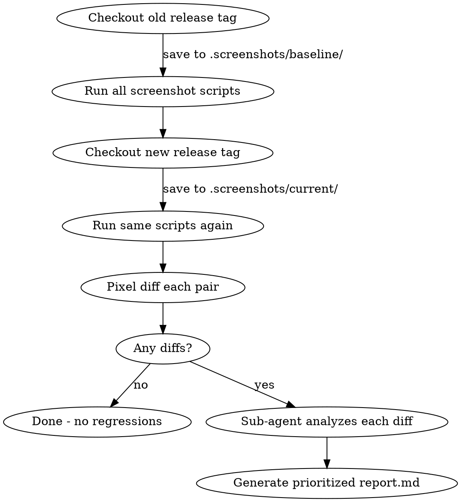

# Visual Regression Testing

## Overview

Two-mode skill for catching visual regressions. During development, create screenshot walkthroughs of affected flows. At release time, compare screenshots between two git refs and use a sub-agent to classify changes as expected or unexpected.

**Core principle:** Screenshots are cheap and regenerable. Never commit them to git. The value is in the *comparison* and *classification*, not the screenshots themselves.

**Dependency:** Playwright must be installed in the project.

## When to Use

- After making any user-facing change (component, layout, CSS, copy)
- Before a release to catch accumulated visual regressions
- When QA is a bottleneck and you need to prioritize what humans review

## When NOT to Use

- API-only or backend-only changes
- As a CI gate on PRs (too slow — run at release time only)

## Common Mistakes

| Mistake | Why it's wrong |
|---------|---------------|
| Committing screenshots to git | They're regenerable. Bloats repo for no value. |
| Running visual comparison in CI on every PR | Too slow. Rob: "You cannot do this in PR merge." |
| Using hard-coded pixel thresholds alone | The key insight is AI-powered analysis of *why* something changed, not just *that* it changed. |
| Over-engineering with versioned baselines and symlinks | Keep it simple: checkout old tag, screenshot, checkout new tag, screenshot, diff. |
| Skipping the textual walkthrough | Screenshots without descriptions are useless for review. Always include what the user sees and what flow this belongs to. |

## Mode 1: `document` (During Development)

When you make a user-facing change, do this:

### Step 1: Identify affected flows

Look at what you changed and list the user flows it touches (e.g., "login flow", "checkout step 2").

### Step 2: Write or update Playwright screenshot scripts

Create scripts under `e2e/visual/` that walk through each affected flow and capture screenshots at each meaningful step.

```typescript
// e2e/visual/login-flow.spec.ts
import { test } from '@playwright/test';

test('login flow walkthrough', async ({ page }) => {
  // Step 1: Landing page
  await page.goto('/');
  await page.waitForLoadState('networkidle');
  await page.screenshot({ path: '.screenshots/flows/login-flow/01-landing-page.png', fullPage: true });

  // Step 2: Click login, see form
  await page.click('[data-testid="login-button"]');
  await page.waitForSelector('[data-testid="login-form"]');
  await page.screenshot({ path: '.screenshots/flows/login-flow/02-login-form.png', fullPage: true });

  // Step 3: Fill and submit
  await page.fill('[name="email"]', 'test@example.com');
  await page.fill('[name="password"]', 'password123');
  await page.click('[data-testid="submit"]');
  await page.waitForSelector('[data-testid="dashboard"]');
  await page.screenshot({ path: '.screenshots/flows/login-flow/03-dashboard.png', fullPage: true });
});
```

### Step 3: Update the manifest

Write a manifest at `.screenshots/manifest.json` describing each flow and screenshot:

```json
{
  "flows": [
    {
      "name": "login-flow",
      "description": "User logs in from landing page to dashboard",
      "screenshots": [
        {
          "file": "flows/login-flow/01-landing-page.png",
          "description": "Landing page with login button in top nav",
          "step": "Navigate to /"
        },
        {
          "file": "flows/login-flow/02-login-form.png",
          "description": "Login modal with email and password fields",
          "step": "Click login button"
        },
        {
          "file": "flows/login-flow/03-dashboard.png",
          "description": "Dashboard view after successful login",
          "step": "Submit valid credentials"
        }
      ],
      "changed_by": "commit abc1234 - Add social login buttons"
    }
  ]
}
```

### Step 4: Gitignore screenshots, commit scripts and manifest

```gitignore
# .gitignore
.screenshots/flows/
.screenshots/baseline/
.screenshots/current/
.screenshots/diffs/
.screenshots/report.md
```

Commit: `e2e/visual/*.spec.ts` and `.screenshots/manifest.json`

## Mode 2: `compare` (At Release Time)



### Step 1: Generate baseline screenshots (old release)

```bash
git checkout v1.2.0
npx playwright test e2e/visual/ --project=chromium
# Screenshots saved to .screenshots/baseline/
git checkout -  # back to current branch
```

### Step 2: Generate current screenshots (new release)

```bash
npx playwright test e2e/visual/ --project=chromium
# Screenshots saved to .screenshots/current/
```

### Step 3: Pixel diff

Use `pixelmatch` or Playwright's built-in comparison. For each screenshot pair (baseline vs current), generate a diff image if pixels changed.

### Step 4: Sub-agent classification (the key innovation)

For every screenshot that differs, spawn a sub-agent with:

**Input:**
- The baseline image
- The current image
- The diff image
- The list of merged PRs/commits between the two tags (`git log v1.2.0..v1.3.0 --oneline`)
- The manifest entry describing what this screenshot shows

**Prompt the sub-agent:**
> Look at the baseline and current screenshots. Identify what visually changed. Then check the merged PRs between these releases. Classify this change:
> - **Expected**: A merged PR explicitly intended this visual change
> - **Unexpected**: No merged PR explains this change — possible regression
>
> Assign a risk level:
> - **High**: Unexpected change, or change to a payment/auth/data-entry flow
> - **Medium**: Expected change but large visual impact
> - **Low**: Expected minor change (copy, spacing, color tweak)
>
> Return: classification, risk level, what changed, which PR caused it (if expected), and recommendation.

### Step 5: Generate report

Write `.screenshots/report.md`:

```markdown
# Visual Regression Report
**Baseline**: v1.2.0 | **Current**: v1.3.0
**Date**: 2026-03-04
**Screenshots**: 24 total | 8 changed | 16 unchanged

## High Risk
### checkout-flow/03-confirmation.png
- **Classification**: Unexpected
- **What changed**: Payment total lost decimal formatting ($50 instead of $50.00)
- **Related PRs**: None found
- **Recommendation**: Investigate before release

## Medium Risk
### dashboard/01-main-view.png
- **Classification**: Expected
- **What changed**: New sidebar navigation added
- **Related PR**: #187 — Add sidebar nav
- **Recommendation**: Verify sidebar matches design spec

## Low Risk
### login-flow/01-landing-page.png
- **Classification**: Expected
- **What changed**: Updated logo
- **Related PR**: #192 — Brand refresh
- **Recommendation**: No action needed
```

## Quick Reference

| Item | Location |
|------|----------|
| Screenshot scripts | `e2e/visual/*.spec.ts` |
| Flow manifest | `.screenshots/manifest.json` |
| Baseline screenshots | `.screenshots/baseline/` (gitignored) |
| Current screenshots | `.screenshots/current/` (gitignored) |
| Diff images | `.screenshots/diffs/` (gitignored) |
| Comparison report | `.screenshots/report.md` (gitignored) |

## Key Principles

1. **Screenshots are dev artifacts, not source code.** Never commit them. They can always be regenerated.
2. **This is NOT a CI tool.** It's too slow for PR merge. Run it at release time on a separate build box.
3. **The sub-agent analysis is what makes this valuable.** Raw pixel diffs are noise. AI classification against merged PRs turns noise into signal.
4. **Chromium only.** Cross-browser pixel comparison is unreliable. Use one browser for deterministic results.
5. **The manifest is the contract.** It tells future agents and humans what each screenshot means and what flow it belongs to.

## Attribution

Based on Rob's technique from the Coding Agents: AI Driven Dev Conference. Rob uses this across multiple projects and calls it a "massive accelerant" for release QA.
